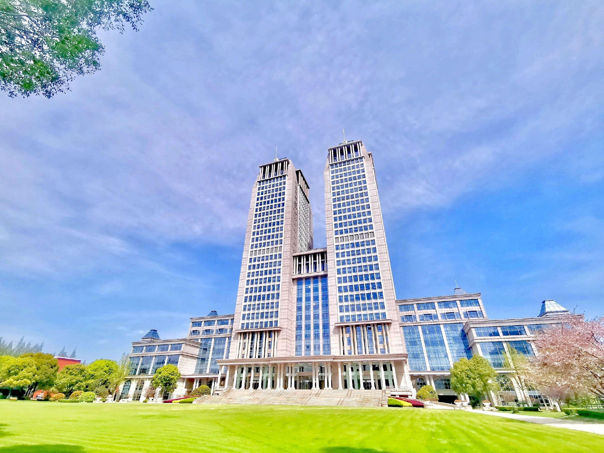
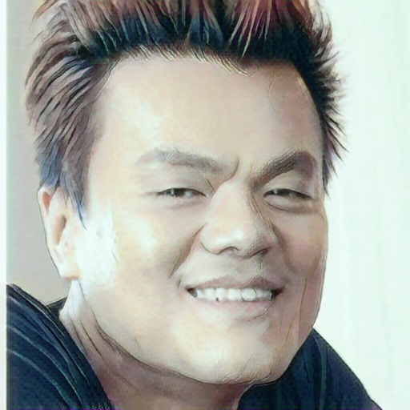
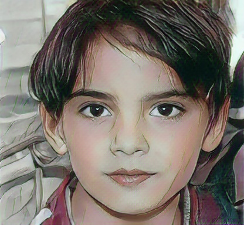

# AnimeGAN Pytorch 

Pytorch implementation of AnimeGANv2 and AnimeGAN for fast photo animation

* Paper: *AnimeGAN: a novel lightweight GAN for photo animation* - [Yoshino repo](https://github.com/TachibanaYoshino/AnimeGAN/blob/master/doc/Chen2020_Chapter_AnimeGAN.pdf)
* AnimeganV2: [Website](https://tachibanayoshino.github.io/AnimeGANv2/)
* Original implementation in [Tensorflow](https://github.com/TachibanaYoshino/AnimeGAN) by [Tachibana Yoshino](https://github.com/TachibanaYoshino)
* AnimeganV2 original implementation in [Tensorflow](https://github.com/TachibanaYoshino/AnimeGAN) by [Tachibana Yoshino](https://github.com/TachibanaYoshino)
* 主要实现参考为[pytorch-animeganv1](https://github.com/ptran1203/pytorch-animeGAN)和[pytorch-animeganv2](https://github.com/wan-h/AnimeGANv2_pytorch)
* 使用了finetune,借鉴了[freeeze_d](https://github.com/sangwoomo/FreezeD)方法与直接全局更改两种方法
* 使用数据集为[animeganv2数据集](https://github.com/TachibanaYoshino/AnimeGANv2/releases),此次只使用了[Shinkai](dataset/shinkai/)（新海诚）数据集进行训练。由于train_photo和Shinkai数据集风景图片偏多，因此风景动漫效果较好
* finetune数据集为[human_face](https://www.kaggle.com/datasets/atulanandjha/lfwpeople),动漫人脸数据集为[another_anime_face](https://www.kaggle.com/datasets/scribbless/another-anime-face-dataset)和[little_anime_face](https://www.kaggle.com/datasets/splcher/animefacedataset)。处理好的数据都处于[dataset](/dataset/)中。


## Documentation

### 1. Prepare dataset

#### 1.1 下载animeganv2数据集或者准备自己数据集

train_photo为真实数据集，可以偏重使用想转换的图片类型，如：风景，人物等。
anime_photo为动漫数据集，结构为{dataset_name}/{style}和{dataset_name}/{smooth},style为原始图片，smooth为边缘模糊后图片

#### 1.2 从video中获取图片

下载视频后用video_to_image.py进行切分得到图片数据集。

**Step 1.** Create anime images from the video

```bash
python script/video_to_images.py --video-path ./dataset/video/test.mp4
                                --save-path ./dataset/test_crop
                                --max-image 1800
                                --image-size 256
```
其中video_path 为video路径，save_path为保存路径，max_image为最大图片数，image_size为最终被转化成的图片大小

**Step 2.** Create edge-smooth version of dataset from **Step 1.**

```bash
python3 script/edge_smooth.py --dataset shinkai --image-size 256
```

### 2. Train animeGAN

To train the animeGAN from command line, you can run `train.py` as the following:

```bash
python train.py --dataset shinakai # 可以是shinkai,hayao或自己准备的数据集
                 --epochs 20 #训练批数
                 --device cpu #训练使用cpu还是gpu
                 --save_interval 5 #训练几个epoch保存一次checkpoint
                 --checkpoint_dir checkpoint #训练得到的checkpoint保存位置
                 --train_photo_path train_photo #训练所使用真实图片文件夹位置
                 --data_dir dataset #训练所使用动漫图片文件夹位置
                 --batch 4 #batch大小
                 --init_epochs 4 #只是用content loss训练的批次
```
### 3. Finetune model

可以在已经预训练好的模型好进行finetune,以适应新的动漫化内容，例如：人脸

```bash
python finetune.py 
            --freeze_d False #是否使用freeze_d方式进行finetune
            --pretrained_dataset #预训练所使用的动漫数据集，主要用于最终finetune的命名
            --dataset anime_face # 可以是shinkai,hayao或自己处理好的数据集
            --epochs 10 #训练批数
            --device cpu #训练使用cpu还是gpu
            --save_interval 1 #训练几个epoch保存一次checkpoint
            --checkpoint_dir checkpoint #训练得到的checkpoint保存位置
            --train_photo_path human_face #训练所使用真实图片文件夹位置
            --data_dir dataset #训练所使用动漫图片文件夹位置
            --batch 4 #batch大小
```
### 4. Transform pytorch model to onnx model, so can inference pictures with openvino

Transform pytorch model to onnx and to ir model, so can inference pictures with openvino by onnx or ir, for example:

```bash
python create_onnx.py 
                --checkpoint checkpoint/freeze_d_face/generator_shinkai_train_24_finetune_10.pth 
                --output_onnx checkpoint/animegan_freeze_d_face_finetune.onnx
```

```bash
!python create_ir.py 
            --input_onnx checkpoint/animegan.onnx 
            --output_ir checkpoint/animegan_ir
```

### 5. Transform images

To convert images in a folder or single image, run `inference_image.py`, for example:

> --src and --dest can be a directory or a file

```bash
python inference_image.py 
                --checkpoint checkpoint_dir #checkpoint所在目录
                --src sample/origin #需转化真实图片所在目录
                --dest sample/anime #被动漫化后保存图片目录
                --type openvino #使用pytorch还是openvino方式进行预测
```

### 6. Transform video

To convert a video to anime version, run `inference_video.py`, for example:

```bash
python inference_video.py 
                --checkpoint checkpoint_dir #checkpoint目录
                --src sample/video/test.mp4 #视频所在地址
                --dest sample/video/test_anime.mp4 #保存视频地址
                --fps_trans 5 #每几帧进行一次转化
                --type openvino #使用pytorch还是openvino方式进行预测
```


## Anime transformation results

| Input(train_photo)| Animation(Shinkai style) |
|--|--|
|||
|||
|||
|||
|||

## face finetune transformation results

|Input |normal| finetune|freeze_D |little_face |
|--|--|--|--|--|
||||||
||||||
||||||
